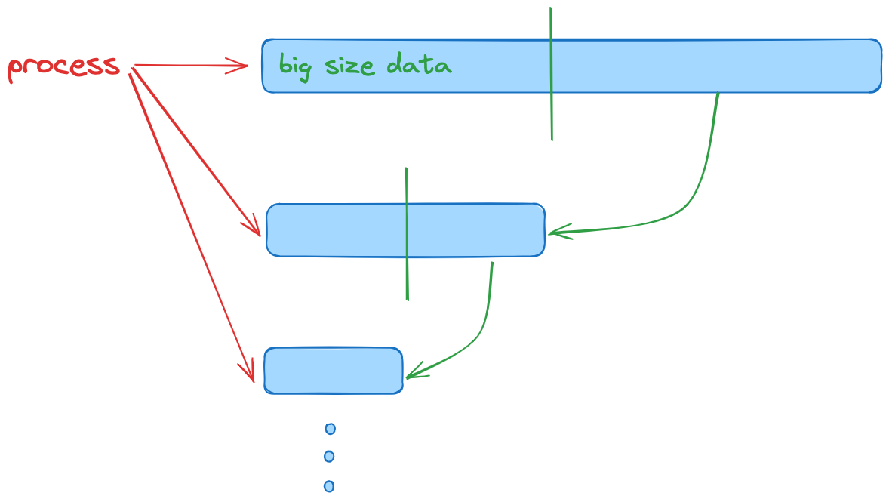

# Divide Conquer ( 분할 정복 )

- [Divide Conquer ( 분할 정복 )](#divide-conquer--분할-정복-)
  - [간당한 정의](#간당한-정의)
  - [주로 적용하는 경우](#주로-적용하는-경우)
  - [도식화](#도식화)
  - [예시 문제](#예시-문제)

## 간당한 정의

큰 데이터를 작은 덩어리로 쪼개서 탐색하는 방법.  
( 조건 : 반드시 정렬되어있는 데이터이어야 함. )

## 주로 적용하는 경우

배열, 문자열 ( + 연결리스트, 트리 )등 큰 규모의 데이터셋을 처리할 때 적용
퀵정렬 병합 정렬에 주로 사용하는 방법
이진 탐색에도 주로 쓰임

## 도식화



## 예시 문제

- 배열과 찾아야하는 타겟 넘버가 주어짐
- 배열에 찾는 넘버가 있으면 해당 index를 반환하고 없으면 -1을 반환한다.

**Simple Idea**

```js
function search(arr, n) {
  for (let i = 0; i < arr.length; i++) {
    if (arr[i] === n) {
      return i;
    }
  }
  return -1;
}
```

인자로 주어지는 모든 배열을 loop를 통해 모두 탐색한다.  
타겟 넘버를 찾으면 해당 index를 반환하고, loop를 다 순회하면 -1을 반환한다. ( 타겟 넘버가 없다고 판단 )

배열의 모든 값들을 비교해야하기 때문 `O(N)`의 시간 복잡도를 가진다.

**Divide Conquer**

```js
function search(arr, n) {
  let start = 0;
  let end = arr.length - 1;

  while (start <= end) {
    let mid = Math.floor((end + start) / 2);

    if (arr[mid] === n) {
      return mid;

      /**
       * 중간의 범위를 점점 줄여 나감.
       * - 해당 mid가 타겟보다 작다면 왼쪽 범위
       * - 해당 mid가 타겟보다 크다면 오른쪽 범위
       * */
    } else if (arr[mid] < n) {
      start = mid + 1;
    } else {
      end = mid - 1;
    }
  }
}

console.log(search([1, 2, 7, 8, 9, 12, 16, 25, 37], 25)); // 7
```

조건문을 시행할 때 마다 탐색해야할 범위가 반으로 줄어듦.  
`O(logN)`의 시간복잡도를 가짐.
